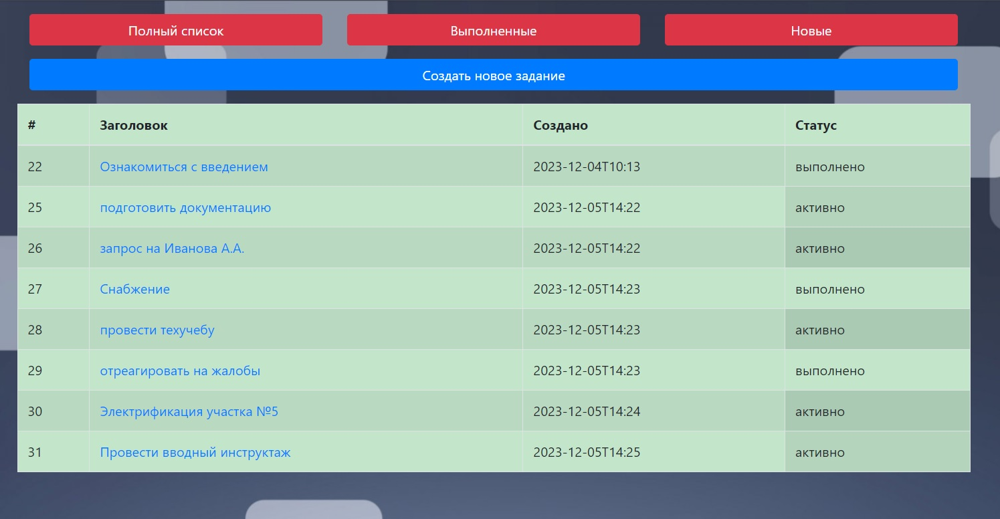
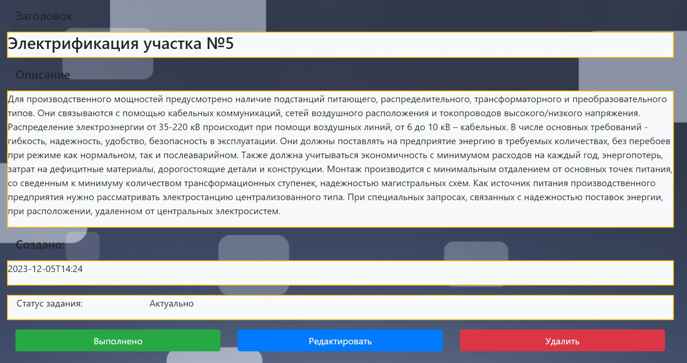
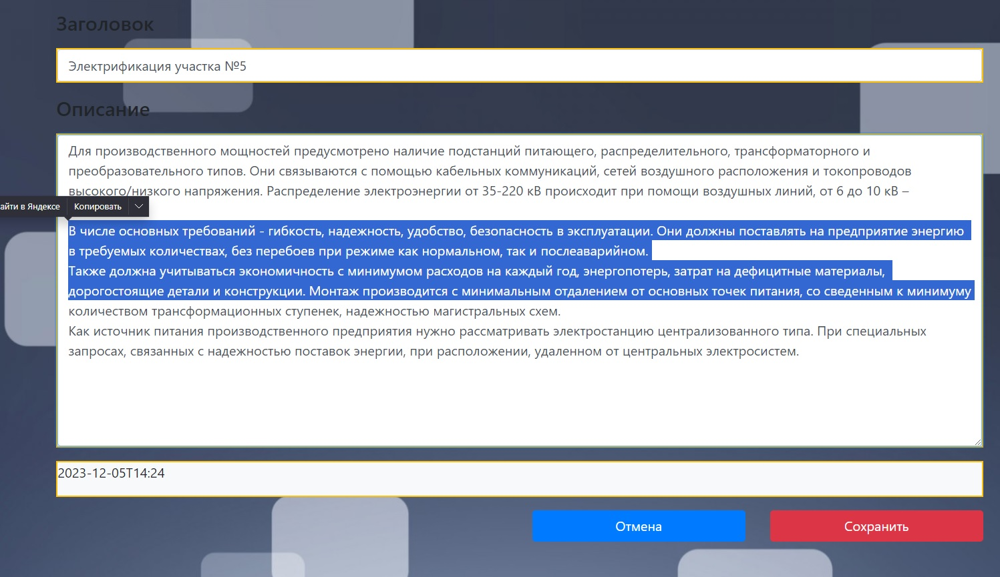
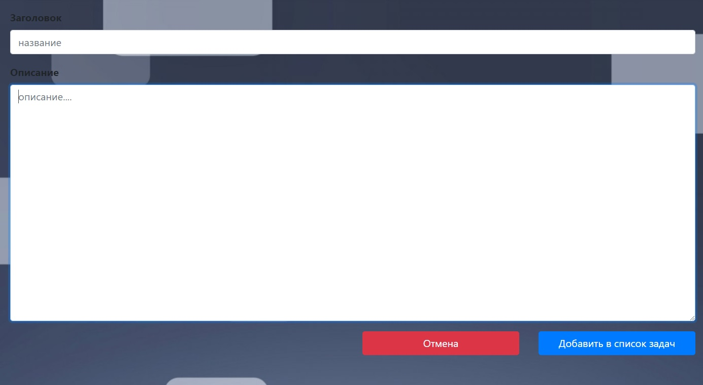

# TODO list

Ревлизация популярного проекта для разработки "todo"
В сервисе имеется возможность создавать, редактировать, удалять 
задачи, а так же устанавливать статус "выполнено".
Есть возможность фильтрации списка задач: "все задачи", "выполненые",
"активные".

В проекте используется:

* Java 17
* Spring Boot 2.7
* PostgreSQL 14
* Hibernate 5.6
* Thymeleaf, Bootstrap
* Liquibase

Требования к окружению: Java 17, Maven 3.8.6, PostgreSQL 14, Git. 

Запуск приложения:

В PostgreSQL необходимо создать базу данных "todo_base". Делаем форк проекта "git clone https://github.com/boris86msk/job4j_todo"
Перейдите в корень проекта и добавьте/измените необходимые настройки для подключения к базе данных в файле src/main/resources/db/liquibase.properties,
src/main/resources/hibernate.cfg.xml, так же если будут занят стандартный порт приложения 8080, измените его в файле src/main/resources/application.properties
на свободный "server.port=8081". Для сборки проекта и запуска миграций в базу данных в корне проекта выполняем команду "mvn install". Для запуска 
приложения из консоли выполняем команду "java -jar target/job4j_todo-0.0.1-SNAPSHOT.jar". В браузере приложение будет доступно по адресу
http://localhost:8080/index (при необходимости смените порт на указанный в application.properties)

Оснавная страница, список всех задач

Просмотр выбраной задачи

Редактирование задачи

Создание новой задачи

Контакты для связи:

